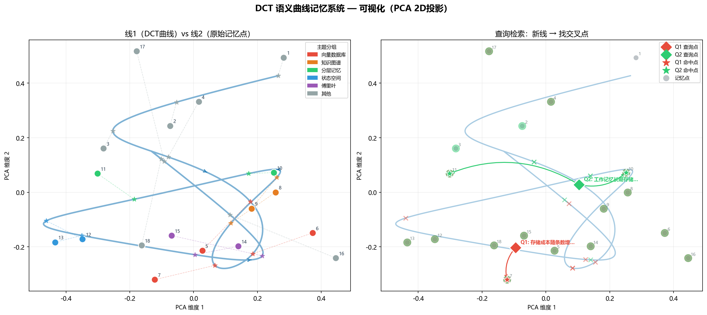
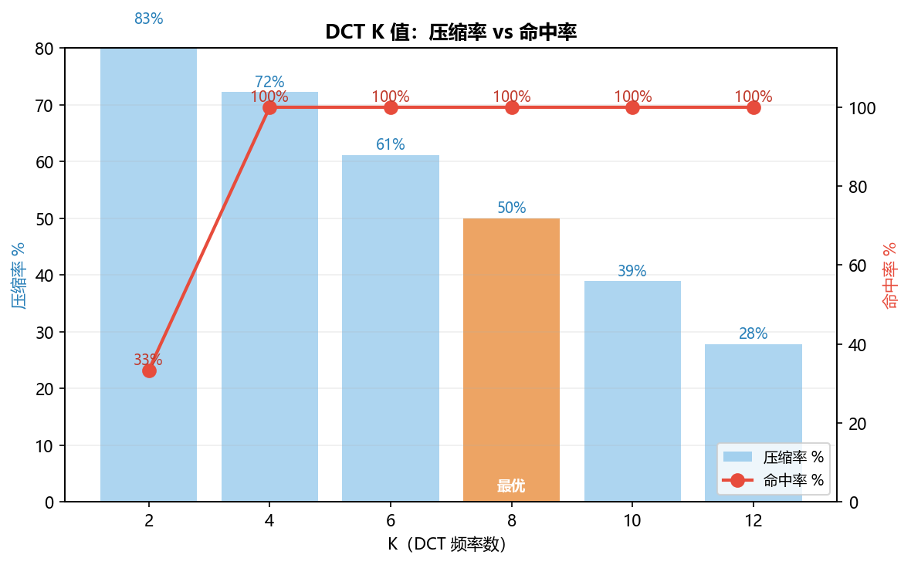

# Semantic Curve Memory

A memory compression system that fits sentence embeddings onto a DCT curve, enabling sub-linear retrieval without storing raw vectors.

---

## The Idea

Traditional vector databases store one embedding per sentence — storage grows linearly with N.

This project explores a different representation: **fit all memory points onto a continuous parametric curve**, then store only the curve's formula coefficients instead of the raw vectors.

```
Memory = intersection of two "lines":
  Line 1 (Semantic Curve) — a DCT formula fitted through all embedding points
  Line 2 (Vector Space)   — the embedding space that defines coordinates

Only points that exist on both lines are valid memories.
Store the formula, not the data.
```

---

## How It Works

**Step 1 — Embed sentences**
Each sentence is encoded into a high-dimensional vector (TF-IDF or sentence-transformers).

**Step 2 — Arc-length parameterization**
Compute cumulative semantic distance between consecutive embeddings to create a 1D parameter `t` for each sentence.

```python
t[0] = 0
t[i] = t[i-1] + ||embedding[i] - embedding[i-1]||
```

**Step 3 — DCT fit**
Fit a DCT (Discrete Cosine Transform) curve through all embedding points using least squares.

```python
# Store only (K+1) × d numbers instead of N × d
coeffs, T, N = dct_fit(t_vals, embeddings, K=8)
```

**Step 4 — Retrieval**
Multi-start optimization finds the point on the curve closest to a query, then binary search (`np.searchsorted`) retrieves candidates in O(log N).

---

## Results

### Storage Compression (N=18 sentences, d=731)

| System | Storage | Compression |
|--------|---------|-------------|
| Vector DB | 13,158 numbers | 0% |
| DCT K=8 | 6,579 numbers | **50%** |
| DCT K=4 + sentence-transformers | 1,920 numbers | **72%** |

### Retrieval Accuracy (6 queries, top-2)

| Method | Hit Rate | Avg. Candidates Checked | Complexity |
|--------|----------|------------------------|------------|
| Linear scan | 6/6 | 18 | O(N) |
| Single t* | 4/6 | 2.8 | O(1) |
| Multi-start (6 starts) | 6/6 | 10.7 | O(N) |
| **Multi-start + Binary Search** | **6/6** | **10.7** | **O(log N)** |

### Scale: Flat vs Hierarchical DCT

| N | Flat DCT K=8 | Hierarchical DCT |
|---|-------------|-----------------|
| 50–200 | 100% | 100% |
| 500 | 40% | **100%** |
| 1,000 | 14% | **100%** |

---

## Visualization

**Semantic curve in 2D (PCA projection)**



Left: DCT curve (blue) passing through memory points (colored by topic). Stars = curve reconstruction. Dashed lines = original → reconstructed.

Right: Query retrieval path. Diamond = query, star = hit, X = t* found by multi-start on the curve.

**K value tradeoff**



K=4 is the break-even point — minimum K to achieve 100% hit rate while maximizing compression.

---

## File Structure

| File | Description |
|------|-------------|
| `semantic_fourier_final.py` | Core DCT memory system (K=8, 50% compression) |
| `memory_benchmark.py` | DCT vs vector DB benchmark |
| `curve_retrieval.py` | 5 retrieval methods including binary search |
| `hierarchical_dct.py` | Hierarchical DCT for large-scale retrieval |
| `real_embedding_test.py` | Validation with sentence-transformers (384-dim) |
| `visualize_curve.py` | PCA 2D visualization of the semantic curve |
| `fourier_memory.py` | Initial Fourier series memory (before DCT) |
| `fourier_article.py` | Article compression test — why character-level fails |
| `fourier_longtext.py` | Long text scale test |

---

## Architecture

```
Flat DCT (small N)
─────────────────
  Embeddings → Arc-length t → DCT fit → Store (K+1)×d coefficients
  Query → Multi-start find t* → Binary search candidates → Cosine re-rank

Hierarchical DCT (large N)
──────────────────────────
  Global layer: cosine search over chunk centroids → O(N/chunk_size)
  Local layer:  DCT search within chunk           → O(chunk_size)
  Total:        O(N/chunk_size + chunk_size)       << O(N)
```

---

## Installation

```bash
pip install numpy scipy scikit-learn sentence-transformers torch matplotlib
```

```bash
# Windows — set UTF-8 output for Chinese text
PYTHONIOENCODING=utf-8 python semantic_fourier_final.py
PYTHONIOENCODING=utf-8 python curve_retrieval.py
PYTHONIOENCODING=utf-8 python hierarchical_dct.py
```

---

## Limitations

- **Compression–accuracy tradeoff**: DCT compression is effective when K << N and the embedding trajectory is smooth. For arbitrary, unordered memories, the trajectory may not be smooth.
- **Hierarchical tradeoff**: Small chunks needed for local DCT accuracy → compression per chunk shrinks to ~10%.
- **Best use case**: Sequential, semantically coherent content (articles, conversations, narratives) where arc-length parameterization produces a smooth curve.

---

## Key Insight

The system works because sentence embeddings of coherent text follow a **smooth trajectory in semantic space** — the manifold hypothesis applied to sequential memory. DCT is efficient at representing smooth signals with few coefficients, which is exactly what this structure provides.
